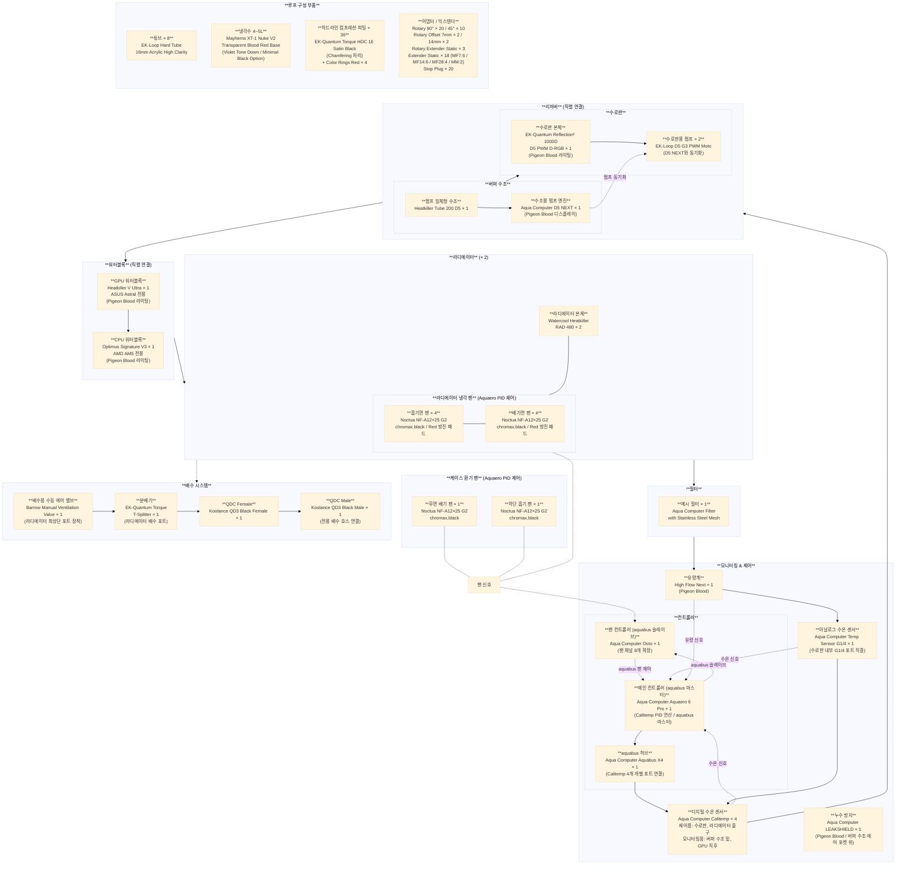
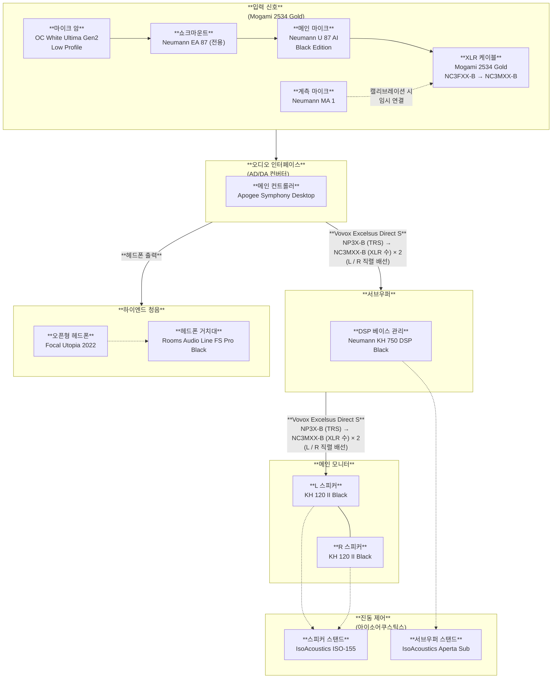

# Rubydian Workstation

---

| 프로필        | Rubydian Workstation                                 |
| ---------- | ---------------------------------------------------- |
| **디자인 색상** | Jet Black (Main Color) Pigeon Blood (Point Color) |

## Hardware

---

### Core

---

|       품목        |                             모델                              |        슬롯         |                                   비고                                    |
| :-------------: | :---------------------------------------------------------: | :---------------: | :---------------------------------------------------------------------: |
|     **CPU**     |                    AMD Ryzen 9 9950 X3D                     |    AM5 Socket     |                                    -                                    |
|     **GPU**     |             NVIDIA GeForce RTX 5090 32GB GDDR7              |  PCIe 5.0 x16\_1   |                            ASUS Astral OC 버전                            |
|     **RAM**     | G.Skill Trident Z5 Neo 6000MT/s CL30-36-36-96 96GB (48GBx2) | DDR5 DIMM A2 & B2 |                             Hynix A-die 선별                              |
|   **Storage**   |              Samsung 9100 Pro NVMe 2.0 2TB SSD              |    PCIe M.2\_1     |              시스템 및 필수 프로그램 설치 자체 방열판 대신 메인보드 M.2 방열판 사용              |
|                 |              Samsung 9100 Pro NVMe 2.0 8TB SSD              |   ROG Q-DIMM.2    | 유저 데이터 저장 및 대용량 프로그램 설치 내부 동봉 M.2 확장 카드 사용 자체 방열판 대신 확장 카드 방열판 사용 |
| **Motherboard** |              ASUS ROG CROSSHAIR X870E EXTREME               |         -         |                                    -                                    |

---

**CPU**:

- **BIOS**:
  - **PBO Mode**: Advanced
  - **Curve Optimizer**: Negative
  - **PBO Limits**: Motherboard
  - **L3 Cache Prioritization**: Auto
  - **Platform Thermal Throttle Limit**: Auto
  - **Data Reuse Technology**: Enabled
  - **Medium Load Booster**: Enabled
  - **AMD 3D V-Cache Technology**: Enabled
  - **Core Parking**: Enabled
  - **Preferred Cores**: Enabled
  - **SMT Control**: Enabled
  - **CPPC Dynamic Preferred Cores**: Cache
- **Windows 제어판**:
  - **전원 관리 옵션**: 균형 조정
- **Windows 설정**:
  - **전원 모드**: 최고의 성능

**GPU**:

- **Physical**:
  - **Dual BIOS Switch**: P-Mode
- **BIOS**:
  - **Re-Size BAR**: Enabled
  - **PCIe Link Speed Enforcement**: Fix Gen 5
  - **Interrupt Steering**: Auto
- **Windows 설정**:
  - **하드웨어 가속 GPU 일정 예약**: Enabled
- **ASUS GPU Tweak III**:
  - **Power Target**: 110%
- **MSI Mode Utility**:
  - **Interrupt Mode**: MSI
  - **Interrupt Priority**: High
- **NVIDIA Apps**:
  - **DLSS Override - Super Resolution 모드**: DLAA (100%)
  - **전원 관리 모드**: 최고 성능 선호
  - **저지연 모드**: 울트라
  - **수직 동기**: Enabled
  - **G-Sync 호환**: Enabled

**RAM**:

- **BIOS**:
  - **Ai Overclock Tuner**: EXPO Tweaked
  - **UCLK DIV1 Mode**: UCLK=MCLK (1:1)
  - **FCLK Frequency**: 2000MHz
  - **Memory Context Restore**: Enabled
  - **Power Down Mode**: Enabled
  - **DRAM Performance Mode**: Performance Mode

**Storage**:

- **Physical**:
  - **RAID**: No RAID
- **BIOS**:
  - **PCIe Bandwidth Configuration**: Fix Gen 5
  - **NVMe RAID Mode**: Disabled
  - **ASPM**: Disabled
  - **APST**: Disabled
  - **L1 Substates**: Disabled
  - **M.2 Link Power Management**: Disabled
- **Samsung Magician**:
  - **Full Power Mode**: Enabled
  - **Write-Cache Buffering**: Enabled
  - **Over-Provisioning**: 5%-10% (Only 8TB)

### Cooling

---

|          품목           |                        모델                        |     수량     |                                                                비고                                                                |
| :-------------------: | :----------------------------------------------: | :--------: | :------------------------------------------------------------------------------------------------------------------------------: |
|       **라디에이터**       |       Watercool Heatkiller Radiator 480mm        |     2      | 상단 배기 위치에 2개 장착 Noctua NF-A12 팬 양면 구성 (흡기면 4개 + 배기면 4개) 8x120mm 상단 트레이 액세서리 추가 사용 Aquaero 6 Pro 컨트롤러와 연결하여 수온 기준 PID 제어 |
|         **팬**         |               Noctua NF-A12×25 G2                | 16 + 1 + 1 |                         라디에이터 양면 16개 + 후면 배기 1개 + 하단 흡기1개 chromax.black 색상 팬 모서리 방진 패드를 Red 컬러로 교체                         |
|      **팬 컨트롤러**       | Aqua Computer Aquaero 6 Pro + Aqua Computer Octo |   1 + 1    |                     Aquaero 6 Pro는 aquabus 마스터로 Calitemp 제어 및 PID 연산 담당 Octo는 aquabus 슬레이브로 연결하여 팬 채널 확장                      |
|    **컨트롤러 확장 허브**     |             Aqua Computer Aquabus X4             |     1      |                                                        Calitemp 4개 개별 연결용                                                        |
|     **수조용 펌프 엔진**     |              Aqua Computer D5 NEXT               |     1      |                    Pigeon Blood 디스플레이 색상 Heatkiller Tube 수조에 장착 EK-Loop D5 G3 펌프와 동기화 aquabus 포트로 연결                    |
|      **수로판용 펌프**      |              EK-Loop D5 G3 PWM Moto              |     2      |                                        Reflection² 1000D 펌프에 2개 장착 D5 NEXT 펌프 엔진과 동기화                                         |
|     **펌프 일체형 수조**     |         Watercool Heatkiller Tube 200 D5         |     1      |                                             Reflection² 1000D 수로판과 직렬 연결하여 버퍼 수조로 사용                                             |
|        **수로판**        |    EK-Quantum Reflection² 1000D D5 PWM D-RGB     |     1      |                                                      Pigeon Blood 톤 라이팅 색상                                                       |
|        **유량계**        |           Aqua Computer High Flow Next           |     1      |                                             Pigeon Blood 톤 라이팅 색상 aquabus 포트로 연결                                              |
|    **아날로그 수온 센서**     |      Aqua Computer Temperature sensor G1/4       |     1      |                                   수로판 내부의 G1/4 포트에 플러그 형태로 장착 센서의 2핀 케이블을 컨트롤러 포트 중 하나에 직결                                    |
|     **디지털 수온 센서**     |              Aqua Computer Calitemp              |     4      |                                     수로판, 라디에이터 출구에 제어용 설치 버퍼 수조 밑, GPU 워터블록 직후에 모니터링용 설치                                      |
|   **배수용 수동 에어 밸브**    |         Barrow Manual Ventilation Valve          |     1      |                        라디에이터의 최상단 다중 포트에 장착 냉각수 배출 시 누르며 사용 수로판 에어 포켓 완전 제거 버퍼 수조 상단 일부 에어 포켓 유지                        |
|     **누수 방지 장치**      |             Aqua Computer LEAKSHIELD             |     1      |                                            Pigeon Blood 디스플레이 색상 버퍼 수조 에어 포켓 위에 장착                                            |
|     **GPU 워터블록**      |           Watercool Heatkiller V Ultra           |     1      |                                          ASUS Astral GPU 전용 모델 Pigeon Blood 톤 라이팅 색상                                          |
|     **CPU 워터블록**      |               Optimus Signature V3               |     1      |                                            AMD AM5 소켓 전용 모델 Pigeon Blood 톤 라이팅 색상                                             |
|        **튜브**         |    EK-Loop Hard Tube 16mm Acryic High Clarity    |     8      |                                                                -                                                                 |
|        **냉각수**        |               Mayhems XT-1 Nuke V2               | 4L ~ 5L 분량 |                 Transparent Blood Red Color Base Violet Color Tone Down Extreme Minimal Black Color Option                 |
|        **필터**         |  Aqua Computer Filter with Stainless Steel Mesh  |     1      |                                                                -                                                                 |
|   **하드라인 컴프레션 피팅**    |       EK-Quantum Torque HDC 16 Satin Black       |     36     |                                                          Chamfering 진행                                                           |
|     **피팅 커스텀 링**      |        EK-Quantum Torque Color Rings Red         |     4      |                                                                -                                                                 |
|      **로터리 어댑터**      |       EK-Quantum Torque Rotary 90° | 45°        |  20 + 10   |                                                                -                                                                 |
|      **로터리 오프셋**      |   - EK-Quantum Torque Rotary Offset 7mm / 14mm   |   2 + 2    |                                           수로판 입출구 포트와 CPU / GPU 워터블록 및 라디에이터 포트 직전에 장착                                           |
|     **로터리 익스탠더**      |     EK-Quantum Torque Rotary Extender Static     |     3      |                                                                                                                                  |
|       **익스탠더**        |        EK-Quantum Torque Extender Static         |     18     |                                             MF 7: 6 MF 14: 6 MF 28: 4 MM: 2                                             |
|      **스톱 플러그**       |              EK-Quantum Torque Plug              |     20     |                                                                -                                                                 |
|        **분배기**        |           EK-Quantum Torque T-Splitter           |     1      |                                라디에이터 배수용 포트에 장착 T-Splitter 한쪽 구멍에 Koolance QD3 Famaile QDC 장착                                 |
| **QDC (퀵 디스커넥트 커플러)** |         Koolance QD3 Black Famale / Male         |     1      |                    Male에 짧은 호스를 연결해 배수 목적 전용 호스로 사용 배수 밸브를 라디에이터로 직결하지 않고 어댑터와 연장관을 해 케이스 하단 전면으로 QDC를 연결                     |

---

### Base

---

|        품목         |                    모델                     |                                                                       비고                                                                        |
| :---------------: | :---------------------------------------: | :---------------------------------------------------------------------------------------------------------------------------------------------: |
|    **PC 케이스**     |          Corsair Obsidian 1000D           |                                                          바닥면에 Black Mirror 색감 아크릴 판 부착                                                          |
|  **PC용 고하중 거치대**  |        Custom Heavy-Duty PC Stand         | 최소 하중 허용치 80kg 이상 플랫폼 규격 750mm × 350mm 이상 (1000D 풋프린트 697mm × 307mm 기준) 4륜 잠금 캐스터 지면 이격 최소 100mm 블랙 파우더 코팅 철제 프레임 진동 흡수 고무 패드 부착 |
|      **PSU**      |          Seasonic PRIME TX-1600           |                                                   Noctua Edition 230V 국제판 버전 (국내 220V 호한)                                                    |
|      **UPS**      |          APC Smart-UPS SMT2200IC          |                                                                여유 공간 확보 후 바닥 직치                                                                 |
|    **서지 보호기**     | APC Performance SurgeArrest PM8-KR 2700J+ |                                                                        -                                                                        |
| **UPS 출력 변환 멀티탭** |              Netmate NM-P06               |                                                                        -                                                                        |
|    **전원 컨디셔너**    |            Furman PL-PRO DMC E            |                                                                        -                                                                        |
|   **내부 USB 헤더**   |           Aqua Computer Hubby 7           |                                                                        -                                                                        |
|    **전원 케이블**     |  CableMod PRO ModMesh Custom PSU Cables   |              Blood Red & Black Color Center Accent Pattern Aluminum Pro Combs (Black) Closed Combs 90 Degree Variant B              |

### Input

---

|       품목        |             모델              |                                      비고                                       |
| :-------------: | :-------------------------: | :---------------------------------------------------------------------------: |
|   **작업용 키보드**   |   Topre RealForce R4HB11    | Hybrid BT Black Fullsize Black US ANSI Layout / 45g Silent Switch |
| **키보드용 손목 받침대** |     HyperX Wrist Rest L     |      작업용 / 게이밍 키보드에서 모두 사용 Wooting 사용 시 오른쪽 끝을 맞춰 마우스 공간을 침범하지 않고 사용       |
|   **게이밍 키보드**   |        Wooting 80HE         |                               Zinc Alloy Black                                |
|   **작업용 마우스**   |    Logitech MX Master 4     |                                       -                                       |
| **다목적 게이밍 마우스** |  Razer Basilisk V3 Pro 35K  |                                       -                                       |
| **경쟁전 게이밍 마우스** |     Razer VIper V4 Pro      |                                       -                                       |
|   **마우스 패드**    | Artisan Hayate Otsu Soft XL |                                       -                                       |
| **마우스용 손목 받침대** |   Delta Hub Carpio G2.0 L   |                                   오른손에만 장착                                    |
|   **매크로 장치**    |  Elgato Stream Deck+ Black  |                                 매크로 및 단축키 제어                                  |
|  **작업 제어 장치**   |        Loupedeck CT         |                                 다이얼 기반 정밀 제어                                  |
|     **웹캠**      |     Elgato Facecam Pro      |                                       -                                       |
|   **웹캡 마운트**    |    Elgato Master Mount L    |                                       -                                       |

### Graphic

---

|       품목        |                    모델                     |                                                      비고                                                      |
| :-------------: | :---------------------------------------: | :----------------------------------------------------------------------------------------------------------: |
|   **서브 모니터**    |               BenQ PD2705Q                |                      좌측 거치 피벗 형태로 배치 문서 작업, 코딩, 웹 열람, 세로 영상 등 보조용 DP 1.4 포트 연결                      |
|   **메인 모니터**    |        LG UltraGear OLED 32GS95UE         |                중앙 거치 일반 형태로 배치 미디어 감상, 3D 그래픽 작업, 게이밍 등 콘텐츠 소비 및 일부 작업용 HDMI 2.1 직결                 |
|   **특수 모니터**    | Dell UltraSharp HDR Premier Color UP3221Q | 우측 거치 일반 형태로 배치 색상 보정, 미디어 작업 등 콘텐츠 제작 및 메인 작업용 DP 2.1 포트 연결 하드웨어 캘리브레이터를 기준점으로 내장 센서의 주기적 상관 교정 |
|    **모니터 암**    |        Humanscale M10 Single Black        |                                               개별 모니터 당 1개씩 구비                                                |
| **하드웨어 캘리브레이터** |         Calibrite Display Plus HL         |                                     특수 모니터 기준으로 계측하여 서브 / 메인 모니터를 프로파일링                                      |

### Audio

---

|      품목       |                           모델                            |                       비고                        |
| :-----------: | :-----------------------------------------------------: | :---------------------------------------------: |
| **오디오 인터페이스** |                 Apogee Symphony Desktop                 |                USB-C to A/C 케이블                 |
|    **스피커**    |                 Neumann KH 120 II Black                 |         Pigeon Blood Highlighting Logo          |
| **진동 방지 스탠드** |                  IsoAcoustics ISO-155                   |                        -                        |
|   **서브우퍼**    |                Neumann KH 750 DSP Black                 |                        -                        |
| **서브우퍼 스탠드**  |                 IsoAcoustics Aperta Sub                 |                        -                        |
| **계측 전용 마이크** |                      Neumann MA 1                       |                        -                        |
|    **헤드셋**    |                    Focal Utopia 2022                    |                        -                        |
|  **헤드셋 거치대**  |              Rooms Audio Line FS Pro Black              |                        -                        |
|    **마이크**    |              Neumann U 87 AI Black Edition              |               내부 동봉된 전용 쇼크마운트 사용                |
|   **마이크 암**   |            OC White Ultima Gen2 Low Profile             |                        -                        |
|  **입력 케이블**   |                    Mogami 2534 Gold                     |                     XLR 암-수                     |
|  **출력 케이블**   |                 Vovox Excelsus Direct S                 |                        -                        |
|  **스피커 플러그**  | Neutrik NP3X-B (TRS 5.5파이) / Neutrik NC3MXX-B (XLR 금도금) |            Symphony Desktop → KH 120            |
| **서브우퍼 플러그**  |     Neutrik NP3X-B (TRS) / Neutrik NC3MXX-B (XLR 수)     |             Neutrik NP3X-B → KH 750             |
|    **커넥터**    | Neutrik NP3X-B | Neutrik NC3MXX-B | Neutrik NC3FXX-B  | Symphony Desktop, KH 750 / 120, KH 750 → KH 120 |

---

### Misc

---

|     품목      |                   모델                   |          비고           |
| :---------: | :------------------------------------: | :-------------------: |
|   **프린터**   |       Epson EcoTank Pro ET-5850        |           -           |
| **네트워크 카드** |             Intel X710-DA1             |  PCIe 4.0 x4 슬롯에 장착   |
|  **광랜 모듈**  |  Intel 10G SFP+ SR Module (E10GSFPSR)  |       DDM 모니터링        |
|  **광패치코드**  | Panduit LC to LC Duplex OM4 Patch Cord |           -           |
| **USB 허브**  |              CalDigit TS4              | Thunderbolt Station 4 |

### Furniture

---

|  제품군   |                모델                 |         비고          |
| :----: | :-------------------------------: | :-----------------: |
| **의자** | Herman Miller Embody Gaming Chair |          -          |
| **책상** |       Secretlab MAGNUS Pro        | Dark Knight Edition |

## Software

---

### Platform

---

|    품목    |        소프트웨어         |    라이선스     |       패키지 원본       |                                                                 비고                                                                  |
| :------: | :------------------: | :---------: | :----------------: | :---------------------------------------------------------------------------------------------------------------------------------: |
| **운영체제** | Microsoft Windows 11 | Windows Pro | Official Setup USB |                                                                  -                                                                  |
| **브라우저** |       Vivaldi        |      -      |       Winget       | 내장 마우스 제스처 비활성화 DarkReader | AdGuard Browser Assistant | Global Speed | Bitwarden Extension Winget을 통한 운영체제 기본 프로그램 통합 최적화 |

### Driver

---

|          품목          |                    소프트웨어                     | 라이선스 |      패키지 원본       |      비고      |
| :------------------: | :------------------------------------------: | :--: | :---------------: | :----------: |
|     **칩셋 드라이버**      |     AMD X870E AM5 Chipset Driver Package     |  -   | Official Homepage |      -       |
|     **그래픽 드라이버**     |           NVIDIA Game Ready Driver           |  -   | Official Homepage |      -       |
|      **GPU 제어**      |      NVIDIA App NVIDIA Control Panel      |  -   | Official Homepage |      -       |
|                      |              ASUS GPU Tweak III              |  -   | Official Homepage |      -       |
|                      |               MSI Mode Utility               |  -   | Official Homepage |      -       |
|     **사운드 드라이버**     |     Realtek High Definition Audio Driver     |  -   | Official Homepage |      -       |
|                      |       Neumann Control Neumann MA 1        |  -   | Official Homepage |      -       |
|                      |          Apogee Control 2 Software           |  -   | Official Homepage |      -       |
|   **유선 네트워크 드라이버**   |             Intel 10G LAN Driver             |  -   | Official Homepage |      -       |
|   **무선 네트워크 드라이버**   | Intel Wi-Fi Driver | Intel Bluetooth Driver |  -   | Official Homepage |      -       |
|  **HID 드라이버 및 제어**   |              RealForce Connect               |  -   | Official Homepage |      -       |
|                      |                  Wootility                   |  -   | Official Homepage |      -       |
|                      |                 Logi Option+                 |  -   | Official Homepage |      -       |
|                      |       Razer Synapse 4 Razer Chroma        |  -   | Official Homepage |      -       |
|                      |          ASUS DisplayWidget Center           |  -   | Official Homepage |      -       |
|   **매크로 및 작업 제어**    |       Elgato Stream Deck Software         |  -   | Official Homepage |      -       |
|                      |              Loupedeck Software              |  -   | Official Homepage |      -       |
| **수랭 시스템 제어 및 모니터링** |            Aqua Coputer Aquasuite            |  -   | Official Homepage | RGB 제어 전권 부여 |
|    **오버클럭 모니터링**     |              ASUS Armoury Crate              |  -   | Official Homepage |      -       |
|     **프린터 드라이버**     |              Epson EcoTank Pro               |  -   | Official Homepage |      -       |
|    **NVMe 드라이버**     |        Samsung Magician & NVMe Driver        |  -   | Official Homepage |      -       |

### Security

---

|         품목          |             소프트웨어              |            라이선스            |      패키지 원본       |                                                          비고                                                          |
| :-----------------: | :----------------------------: | :------------------------: | :---------------: | :------------------------------------------------------------------------------------------------------------------: |
|  **안티 바이러스 소프트웨어**  |       ESET Home Security       | ESET Home Security Premium |      Winget       |                                       AppCheck 상호 예외 설정 WebProtection 비활성화                                        |
|  **안티 랜섬웨어 소프트웨어**  |       CheckMAL AppCheck        |        AppCheck Pro        |      Winget       |                                                    ESET 상호 예외 설정                                                     |
|  **네트워크 보안 소프트웨어**  |         ESET Firewall          | ESET Home Security Premium |      Module       |                                                       ESET 내장                                                        |
|  **네트워크 관제 소프트웨어**  |      SecureMix GlassWire       |     GlassWire Premium      |       Scoop       |                                                     방화벽 기능 비활성화                                                      |
|    **칩입 탐지 시스템**    | ESET Network Attack Protection | ESET Home Security Premium |      Module       |                                                       ESET 내장                                                        |
| **설치형 악성 코드 제거 도구** |          Malwarebytes          |    Malwarebytes Premium    |      Winget       |                                             실시간 보호 비활성화 주 1회 자동 전체 검사                                             |
| **포터블 악성 코드 제거 도구** |          Malware Zero          |             -              | Official Homepage |                                                    감염 의심 시 수동 검사                                                     |
|   **블로트웨어 소거 도구**   |             구라제거기              |             -              | Official Homepage |                                                 블로트웨어 설치 의심 시 수동 실행                                                  |
|     **VPN 서비스**     |           ProtonVPN            |       ProtonVPN Plus       |      Winget       | WireGuard UDP 프로토콜 Kill Switch Non-Permanent 활성화 NetShield 비활성화 VPN Accelerator 활성화 일부 VPN 차단 사이트 분할 터널링 |
|    **비밀번호 관리자**     |           Bitwarden            |             -              |       Scoop       |                                             Vaultwarden NAS Self-hosting                                             |
|     **컨텐츠 차단기**     |            AdGuard             |      AdGuard Familys       |      Winget       |                  WFP 드라이버 모드 사용 HTTPS 필터링 활성화 EV 인증서 웹사이트 필터링 활성화 AdGuard DNS-over-QUIC 사용                  |
|    **클라우드 아카이브**    |             IDrive             |   IDrive Personal 100TB    |      Winget       |                                                       분기 1회 백업                                                       |

### Workspace

---

|      품목       |           소프트웨어           |             라이선스              |      패키지 원본       |                   비고                    |
| :-----------: | :-----------------------: | :---------------------------: | :---------------: | :-------------------------------------: |
|  **워드프로세서**   |    Microsoft Word 2026    |     Microsoft 365 Premium     | Official Homepage |                    -                    |
|               |    Hancom Hangul 2024     |          Hancom Docs          |     Homepage      |                    -                    |
|  **프레젠테이션**   | Microsoft PowerPoint 2026 |     Microsoft 365 Premium     | Official Homepage |                    -                    |
|  **스프레드시트**   |   Microsoft Excel 2026    |     Microsoft 365 Premium     | Official Homepage |                    -                    |
|  **PDF 리더**   |     Adobe Acrobat Pro     | Adobe Creative Cloud All Apps | Official Homepage |                    -                    |
|   **간편 메모**   |        Google Keep        |        Google AI Ultra        |    Web Service    |                    -                    |
|  **협업 프로젝트**  |          Notion           |          Notion Plus          |       Scoop       |                    -                    |
| **메일 클라이언트**  |          Outlook          |     Microsoft 365 Premium     | Official Homepage |                    -                    |
| **클라우드 스토리지** |          DropBox          |    DropBox Essentials 3TB     |       Scoop       | 파일 공유 & 동기화, 오피스 작업용 파일 저장 및 백업은 NAS |
|               |       Google Drive        |        Google AI Ultra        |      Winget       |   갤러리 동기화, 외부 협업용 미디어는 NAS에 추가 백업    |
|  **AI 서비스**   |          ChatGPT          |          ChatGPT Pro          |      Winget       |                    -                    |
|               |          Claude           |          Claude Max           |       Scoop       |                    -                    |
|               |          Gemini           |        Google AI Ultra        |    Web Service    |                    -                    |

### Creative

---

|           품목           |       소프트웨어        |             라이선스              |      패키지 원본       |                 비고                 |
| :--------------------: | :----------------: | :---------------------------: | :---------------: | :--------------------------------: |
|     **데스크탑 퍼블리싱**      |   Adobe InDesign   | Adobe Creative Cloud All Apps | Official Homepage |                 -                  |
|     **비트맵 그래픽 툴**      |  Adobe Photoshop   | Adobe Creative Cloud All Apps | Official Homepage |                 -                  |
|      **벡터 그래픽 툴**      | Adobe Illustrator  | Adobe Creative Cloud All Apps | Official Homepage |                 -                  |
|      **3D 그래픽 툴**      |      Blender       |               -               |       Scoop       |               - -               |
|                        |       ZBrush       |       ZBrush Personal      |      Winget       |                 -                  |
| **영상 편집 / 영상 색상 보정 툴** |  DaVinci Resolve   |    DaVinci Resolve Studio     |      Winget       | XML/EDL 내보내기를 통한 Adobe CC와의 작업물 공유 |
|      **음향 편집 툴**       |   Adobe Audition   | Adobe Creative Cloud All Apps | Official Homepage |                 -                  |
|   **특수 효과 / 모션 그래픽**   | Adobe After Effect | Adobe Creative Cloud All Apps | Official Homepage |                 -                  |
|     **사진 색상 보정 툴**     |  Adobe Lightroom   | Adobe Creative Cloud All Apps | Official Homepage |                 -                  |

### Dev Stack

---

|        품목        |              소프트웨어               |            라이선스             |         패키지 원본          |                                                                                             비고                                                                                             |
| :--------------: | :------------------------------: | :-------------------------: | :---------------------: | :----------------------------------------------------------------------------------------------------------------------------------------------------------------------------------------: |
|    **단순 메모장**    |             Notepads             |              -              |          Scoop          |                                                                                             -                                                                                              |
|   **마크다운 편집기**   |              Typora              |         Typora EULA         |          Scoop          |                                                                              단일 파일 마크다운 파일 편집 및 텍스트 기반 문서 작업                                                                               |
| **개인 지식 관리 시스템** |             Obsidian             |              -              |          Scoop          | 지식 관리 시스템 구축 Self-hosted Live Sync Plugin를 통해 NAS Container 동기화 Quartz & Quartz Syncer Plugin과 GitHub & Vercel 를 통해 정적 웹 게시 Obsidian-Remote NAS Container Package를 통해 외부 환경 웹 액세스 |
|   **텍스트 편집기**    |            Notepad++             |              -              |          Scoop          |                                                                                 대용량 텍스트 파일 분석 및 단순 텍스트 수정                                                                                  |
|    **코드 에디터**    |        Visual Studio Code        |              -              |          Scoop          |                                                               LaTeX 편집 (LaTeX Workshop Extension) 포맷팅 및 스크립팅 SSH 원격 접속                                                               |
|   **통합 개발 환경**   |        Visual Studio IDE         | Visual Studio Professional  | Visual Studio Installer |                                                     ReSharper C++ Plugin C / C++ | Windows Native Programing CMake 표준 빌드 프리셋 사용                                                     |
|                  |         JetBrains Rider          | JetBrains All Products Pack |    JetBrains Toolbox    |                                                                           C# / F# | Game Engine | .NET Backend                                                                           |
|                  | JetBrains IntelliJ IDEA Ultimate | JetBrains All Products Pack |    JetBrains Toolbox    |     Java / Kotlin | JVM Backend  Pure Python | Python Backend | Data Analysis | AI Model Training Pure Rust | Rust Backend | System Programing JS / TS | Web Frontend      |
|   **LaTeX 엔진**   |             TeX Live             |              -              |          Scoop          |                                                                                             -                                                                                              |
|  **데이터베이스 관리**   |             Navicat              |       Navicat Premium       |          Scoop          |                                                                                         종합 설계 및 관리                                                                                         |
|                  |    JetBrains IDE 내장 DataGrip     | JetBrains All Products Pack |         Module          |                                                                                       개발 단계 조회 및 확인                                                                                        |
|   **버전 관리 엔진**   |               Git                |              -              |          Scoop          |                                                                                             -                                                                                              |
| **버전 관리 클라이언트**  |            GitKraken             |        GitKraken Pro        |          Scoop          |                                                                                     메인 레포지토리 / 브랜치 관리                                                                                      |
|                  |     IDE 내장 및 VS Code 확장 Git      |              -              |         Module          |                                                                                   단순 커밋 / 푸시 및 수정 이력 확인                                                                                    |

### Utility

---

|        품목         |          소프트웨어           |              라이선스              |   패키지 원본    |                            비고                            |
| :---------------: | :----------------------: | :----------------------------: | :---------: | :------------------------------------------------------: |
|  **파티션 관리 프로그램**  | EaseUs Partition Master  |  EaseUs Partition Master Pro   |   Winget    |                            -                             |
| **디스크 백업 소프트웨어**  |    EaseUS Todo Backup    |    EaseUS Todo Backup Home     |   Winget    |                            -                             |
| **디스크 복구 소프트웨어**  |         R-Studio         |       R-Studio Standard        |   Winget    |                            -                             |
|   **터미널 에뮬레이터**   |         WezTerm          |               -                |    Scoop    |                            -                             |
|   **CLI 유틸리티**    |           eza            |               -                |    Scoop    |                          ls 대체                           |
|                   |           bat            |               -                |    Scoop    |                          cat 대체                          |
|                   |           fzf            |               -                |    Scoop    |                       대화형 인터페이스 도구                       |
|                   |          zoxide          |               -                |    Scoop    |                          cd 대체                           |
|                   |         ripgrap          |               -                |    Scoop    |                          rg 대체                           |
|                   |            fd            |               -                |    Scoop    |                         find 대체                          |
|                   |          delta           |               -                |    Scoop    |                       git diff 대체                        |
|                   |           dust           |               -                |    Scoop    |                          du 대체                           |
|                   |          bottom          |               -                |    Scoop    |                       CLI용 작업 관리자                        |
|  **터미널 커스터마이징**   |         Starship         |               -                |    Scoop    |                            -                             |
|  **인라인 권한 부여자**   |          Gsudo           |               -                |    Scoop    | \$PROFILE에 sudo 명칭으로 함수 등록 Windows 기본 개발자 기능 Sudo 비활성화 |
|    **패키지 관리자**    |          Scoop           |               -                |   GitHub    |                            -                             |
|   **IDE 설치 관리**   |    JetBrains Toolbox     |               -                |   Winget    |                            -                             |
|                   |         Innounp          |               -                |    Scoop    |                            -                             |
| **시스템 요약 정보 출력**  |        Fastfetch         |               -                |    Scoop    |                            -                             |
|    **파일 관리자**     |      Directory Opus      |  Directory Opus Professional   |   Winget    |                            -                             |
|   **드라이브 마운트**    |         RaiDrive         |     RaiDrive Professional      |   Winget    |                            -                             |
|   **압축 파일 관리자**   |         BandiZip         |          BandiZip Pro          |    Scoop    |                            -                             |
|                   |           7zip           |               -                |    Scoop    |                     Scoop 내부 패키지 관리용                     |
|    **파일 복사기**     |         FastCopy         |               -                |    Scoop    |                    Directory Opus 연동                     |
|    **파일 검색기**     |        Everything        |               -                |    Scoop    |                    Directory Opus 연동                     |
|    **작업 관리자**     |     System Informer      |               -                |    Scoop    |                            -                             |
| **하드웨어 진단 및 분석**  |         Hwinfo64         |               -                |    Scoop    |                            -                             |
| **디스크 모니터링 및 진단** |    Crystal Disk Info     |               -                |    Scoop    |                            -                             |
|    **운영체제 확장**    |        PowerToys         |               -                |    Scoop    |                            -                             |
|  **시스템 커스터마이징**   |     Winaero Tweaker      |               -                |    Scoop    |                            -                             |
|   **창 관리 프로그램**   |        WindowGrid        |               -                |   Winget    |                        격자 기반 창 관리                        |
|                   |         AltSnap          |               -                |   Winget    |                        스냅 기능 편의성                         |
|   **멀티 모니터 관리**   |      DisplayFusion       |       DisplayFusion Pro        |   Winget    |           종합 멀티모니터 관리 마우스 경계면 걸림 방지 기능 비활성화           |
|                   |      LittleBigMouse      |               -                |    Scoop    |                    마우스 경계면 걸림 방지 최적화                     |
|   **앰비언트 라이트**    | Signify Philips Hue Sync |               -                |   Winget    |                      소프트웨어 앰비언트 라이트                      |
|  **다크 모드 자동 전환**  |       AutoDarkMode       |               -                |    Scoop    |                            -                             |
|    **마우스 제스처**    |     StrokesPlus.net      |               -                |    Scoop    |                            -                             |
|   **클립보드 동기화**    |       ClipCascade        |               -                |   GitHub    |                      NAS 중심 P2S 방식                       |
|  **P2P 파일 전송기**   |    Google QuickShare     |               -                |   Winget    |                            -                             |
|  **입력 장치 에뮬레이터**  |      Unified Remote      |      Unified Remote Full       |   Winget    |                            -                             |
|  **화면 녹화 프로그램**   |        OBS Studio        |               -                |    Scoop    |                            -                             |
|     **캡처 도구**     |         Snipaste         |               -                |    Scoop    |                            -                             |
|    **이미지 뷰어**     |        BandiView         |         BandiView Pro          |   Winget    |                            -                             |
|   **미디어 플레이어**    |     PotPlayer Global     |               -                |   Winget    |                            -                             |
|      **번역기**      |    DeepL Translation     | DeepL Translation Pro Ultimate |   Winget    |                            -                             |
|    **문장 교정기**     |       DeepL Write        |    DeepL Write Pro Ultimate    |   Module\`   |                       DeepL 부가 기능                        |
|    **문법 검사기**     |        Grammarly         |         Grammarly Pro          |    Scoop    |                            -                             |
|                   |   바른한글 (구 부산대 맞춤법 검사기)   |               -                | Web Service |                            -                             |

### Communication

---

|      분류군      |     소프트웨어      |          라이선스           |   패키지 원본    |                비고                |
| :-----------: | :------------: | :---------------------: | :---------: | :------------------------------: |
| **인스턴트 메신저**  |    Discord     |      Discord Nitro      |    Scoop    |                -                 |
|               |   KakaoTalk    |      TalkCloud 1TB      |    Scoop    | TalkCloud는 대화, 사진, 동영상 백업용으로만 사용 |
|               |     Slack      |        Slack Pro        |    Scoop    |                -                 |
| **화상 통화 서비스** | Zoom Workplace | Zoom Workplace Business |    Scoop    |                -                 |
|               |  Google Meet   |     Google AI Ultra     | Web Service |                -                 |
